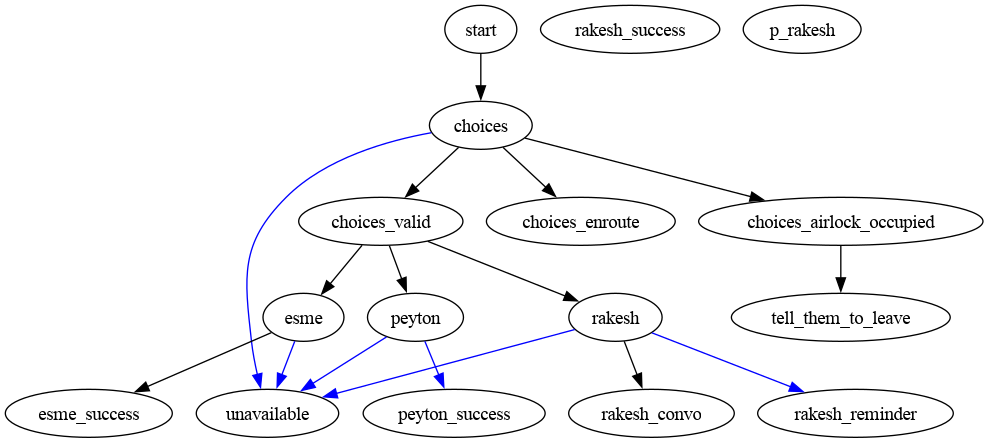
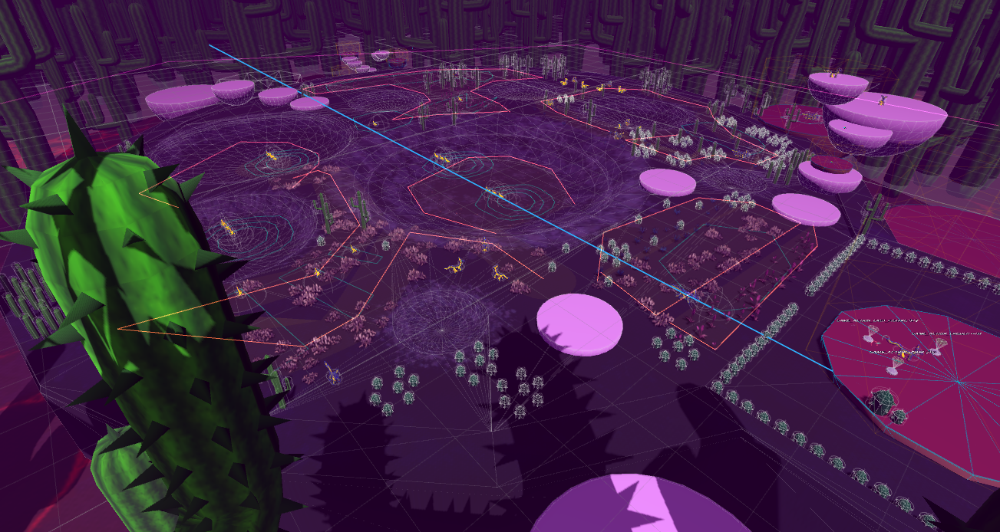
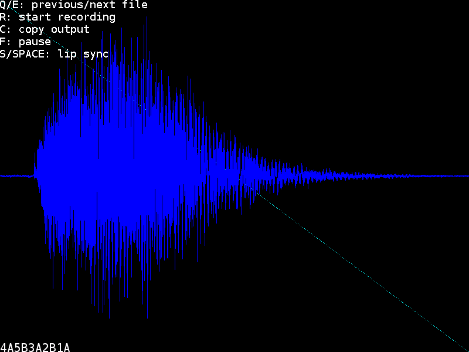

# Vessels

Made in Unreal 4, [Steam](https://store.steampowered.com/app/1371330/Vessels/)

- Won IGF 2021 Best Student Game
- Dialogue engine handles 16,000 lines

::: slides

:::

---

# Game Jams

Various teams with various engines, [Itch.io](https://gertkeno.itch.io/)

::: slides

:::

---

# RIFT

Making new features in an old codebase, [Steam](https://store.steampowered.com/app/39120/RIFT/)

- Gameplay and UI

::: slides

:::

---

# Flappatron

- [Steam](https://store.steampowered.com/app/1009750/Flappatron/)
- Automatic and Manual Lip syncing tools

::: slides

:::

---

# MyCodingPlace

- [Website](https://www.mycodingplace.com/)
- Setup VPN and file server
- Teaching game programming

